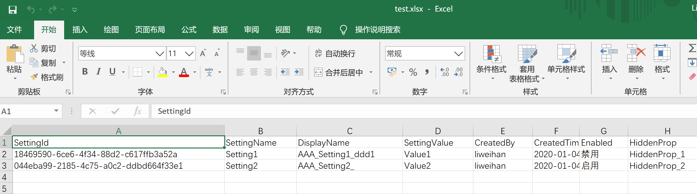
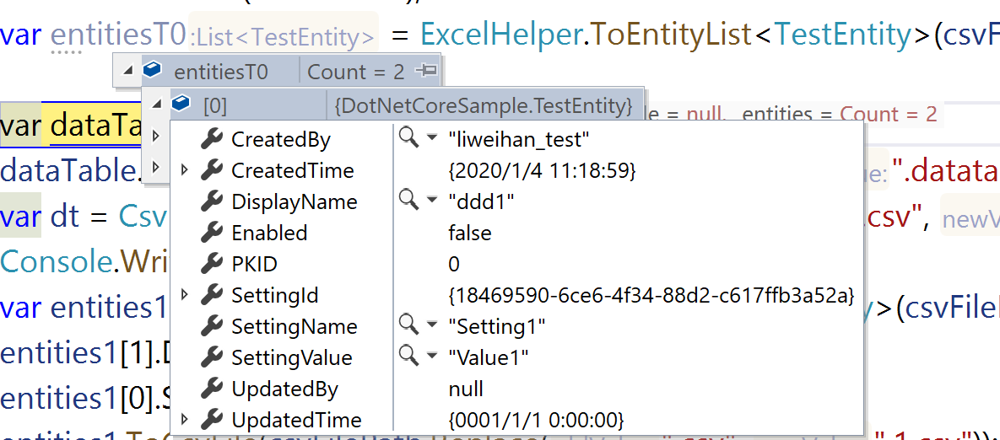
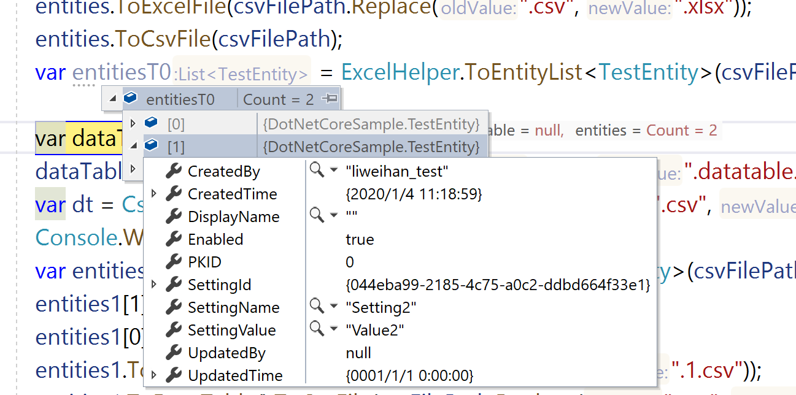

# InputOutputFormatter Introduction

## Introduction

WeihanLi.Npoi introduces `OutputFormatter`/`InputFormatter`/`ColumnInputFormatter`/`ColumnOutputFormatter`, greatly enhancing the flexibility of import and export operations. These are only supported through FluentAPI configuration. Let's look at the following example.

## InputFormatter/OutputFormatter

Example Model:

``` csharp
internal abstract class BaseEntity
{
    public int PKID { get; set; }
}

internal class TestEntity : BaseEntity
{
    public Guid SettingId { get; set; }

    public string SettingName { get; set; }

    public string DisplayName { get; set; }
    public string SettingValue { get; set; }

    public string CreatedBy { get; set; } = "liweihan";

    public DateTime CreatedTime { get; set; } = DateTime.Now;

    public string UpdatedBy { get; set; }

    public DateTime UpdatedTime { get; set; }

    public bool Enabled { get; set; }
}
```

Example Configuration:

``` csharp
var setting = FluentSettings.For<TestEntity>();
// ExcelSetting
setting.HasAuthor("WeihanLi")
    .HasTitle("WeihanLi.Npoi test")
    .HasDescription("WeihanLi.Npoi test")
    .HasSubject("WeihanLi.Npoi test");

setting.HasSheetConfiguration(0, "SystemSettingsList", 1, true);

setting.Property(_ => _.SettingId)
    .HasColumnIndex(0);

setting.Property(_ => _.SettingName)
    .HasColumnTitle("SettingName")
    .HasColumnIndex(1);

setting.Property(_ => _.DisplayName)
    .HasOutputFormatter((entity, displayName) => $"AAA_{entity.SettingName}_{displayName}")
    .HasInputFormatter((entity, originVal) => originVal.Split(new[] { '_' })[2])
    .HasColumnTitle("DisplayName")
    .HasColumnIndex(2);

setting.Property(_ => _.SettingValue)
    .HasColumnTitle("SettingValue")
    .HasColumnIndex(3);

setting.Property(_ => _.CreatedTime)
    .HasColumnTitle("CreatedTime")
    .HasColumnIndex(4)
    .HasColumnWidth(10)
    .HasColumnFormatter("yyyy-MM-dd HH:mm:ss");

setting.Property(_ => _.CreatedBy)
    .HasColumnInputFormatter(x => x += "_test")
    .HasColumnIndex(4)
    .HasColumnTitle("CreatedBy");

setting.Property(x => x.Enabled)
    .HasColumnInputFormatter(val => "Enabled".Equals(val))
    .HasColumnOutputFormatter(v => v ? "Enabled" : "Disabled");

setting.Property("HiddenProp")
    .HasOutputFormatter((entity, val) => $"HiddenProp_{entity.PKID}");

setting.Property(_ => _.PKID).Ignored();
setting.Property(_ => _.UpdatedBy).Ignored();
setting.Property(_ => _.UpdatedTime).Ignored();
```

Test Code:

``` csharp
var entities = new List<TestEntity>()
{
    new TestEntity()
    {
        PKID = 1,
        SettingId = Guid.NewGuid(),
        SettingName = "Setting1",
        SettingValue = "Value1",
        DisplayName = "ddd1"
    },
    new TestEntity()
    {
        PKID=2,
        SettingId = Guid.NewGuid(),
        SettingName = "Setting2",
        SettingValue = "Value2",
        Enabled = true
    },
};
var path = $@"{tempDirPath}\test.xlsx";
entities.ToExcelFile(path);
var entitiesT0 = ExcelHelper.ToEntityList<TestEntity>(path);
```

Export Result:




Import Result:




