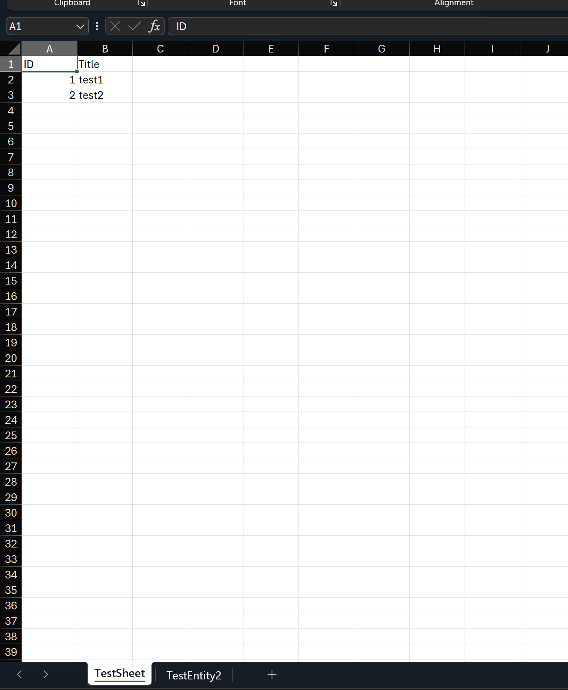
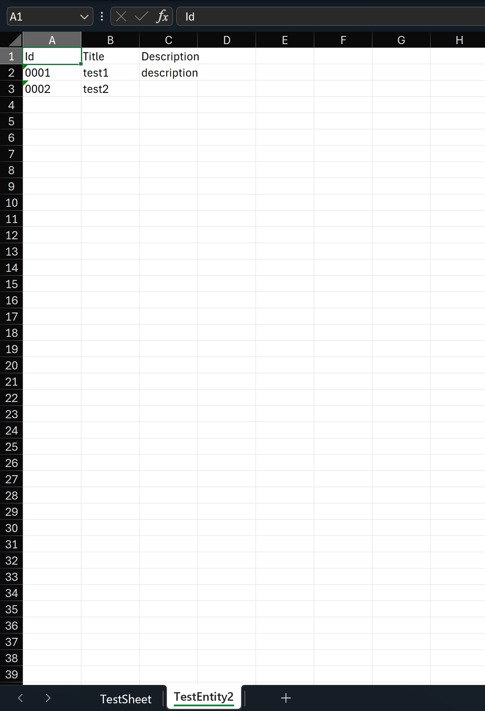

# Multi-Sheet Export

## Introduction

Sometimes we may want to export multiple collections of data in multiple sheets within a single Excel file. You can refer to the following example code:

## Sample

```c#
var collection1 = new[]
{
    new TestEntity1() { Id = 1, Title = "test1" },
    new TestEntity1() { Id = 2, Title = "test2" }
};
var collection2 = new[]
{
    new TestEntity2() { Id = 1, Title = "test1", Description = "description"},
    new TestEntity2() { Id = 2, Title = "test2" }
};
// Prepare a workbook
var workbook = ExcelHelper.PrepareWorkbook(ExcelFormat.Xlsx);
// Import collection1 to the first sheet
workbook.ImportData(collection1);
// Import collection2 to the second sheet
workbook.ImportData(collection2, 1);
// Export workbook to local file
workbook.WriteToFile("multi-sheets.xlsx");
```

If you need to customize configurations, it works the same as before - you can use attributes or fluent API:

```c#
[Sheet(SheetName = "TestSheet", SheetIndex = 0)]
file sealed class TestEntity1
{
    [Column("ID", Index = 0)]
    public int Id { get; set; }
    public string Title { get; set; } = string.Empty;
}

file sealed class TestEntity2
{
    public int Id { get; set; }
    public string Title { get; set; } = string.Empty;
    public string Description { get; set; }
}
```

Fluent API configuration:

```c#
var settings = FluentSettings.For<TestEntity2>();
settings.HasSheetSetting(sheet => sheet.SheetName = "TestEntity2", 1);
settings.Property(x => x.Id)
    .HasColumnIndex(0)
    .HasColumnOutputFormatter(v => v.ToString("#0000"))
    ;
settings.Property(x => x.Title)
    .HasColumnIndex(1)
    ;
settings.Property(x => x.Description)
    .HasColumnIndex(2)
    ;
```

Export results:





## References

- <https://github.com/WeihanLi/SamplesInPractice/blob/main/NPOISample/MultiSheetsSample.cs>
- <https://github.com/WeihanLi/WeihanLi.Npoi/issues/157>
