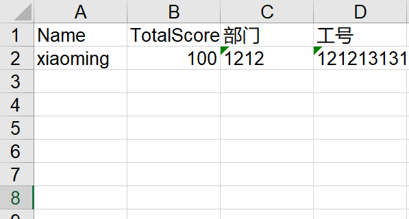

# WeihanLi.Npoi Now Supports `ShadowProperty`

## Introduction

In Entity Framework, there's a concept called `ShadowProperty` (Shadow Property). You can define a property through FluentAPI that is not defined in the .NET model, and this property can only be operated through EF's `Change Tracker`.

When exporting to Excel, you might want some exported columns not to be defined in your model. Some columns might just be added to export a nested property value, or you simply want to define an additional column while the model is defined elsewhere and is inconvenient to modify.

Therefore, starting from version 1.6.0, `WeihanLi.Npoi` supports `ShadowProperty`, bringing the concept from EF into Excel export. Currently, `ShadowProperty` is read-only - reading returns the default value of the type, and it doesn't support `ChangeTracker` or modifications.

## Usage Example

Here's a simple usage example (from a user-submitted issue: <https://github.com/WeihanLi/WeihanLi.Npoi/issues/51>)

``` csharp
using System;
using System.Collections.Generic;
using System.IO;
using WeihanLi.Npoi;

namespace NpoiTest
{
    public class Program
    {
        public static void Main(string[] args)
        {
            var settings = FluentSettings.For<TestEntity>();
            settings.Property(x => x.Name)
                .HasColumnIndex(0);
            // settings.Property(x => x.UserFields)
            //     .HasOutputFormatter((entity, value) => $"{value[0].Value},{value[2].Value}")
            //     .HasColumnTitle("Name,Employee ID")
            //     .HasColumnIndex(1);
            settings.Property(x=>x.UserFields).Ignored();
            settings.Property("Employee ID")
                .HasOutputFormatter((entity,val)=> $"{entity.UserFields[2].Value}")
                 ;
            settings.Property("Department")
                .HasOutputFormatter((entity,val)=> $"{entity.UserFields[1].Value}")
                 ;

            var data = new List<TestEntity>()
            {
                new TestEntity()
                {
                    Name = "xiaoming",
                    TotalScore = 100,
                    UserFields = new UserField[]
                    {
                        new UserField()
                        {
                            Name = "Name",
                            Value = "xaioming",
                        },
                        new UserField()
                        {
                            Name = "Department",
                            Value = "1212"
                        },
                        new UserField()
                        {
                            Name = "Employee ID",
                            Value = "121213131"
                        },
                    }
                }
            };
            data.ToExcelFile($@"{Directory.GetCurrentDirectory()}\output.xls");
            Console.WriteLine("complete.");
        }

        private class TestEntity
        {
            public string Name { get; set; }

            public UserField[] UserFields { get; set; }

            public int TotalScore { get; set; }
        }

        private class UserField
        {
            public string Fid { get; set; }
            public string Name { get; set; }
            public string Value { get; set; }
        }
    }
}
```

Export result:



As you can see, we added two columns to the exported Excel that were not defined in the original Model. With this feature, we can more flexibly customize the content to be exported.
