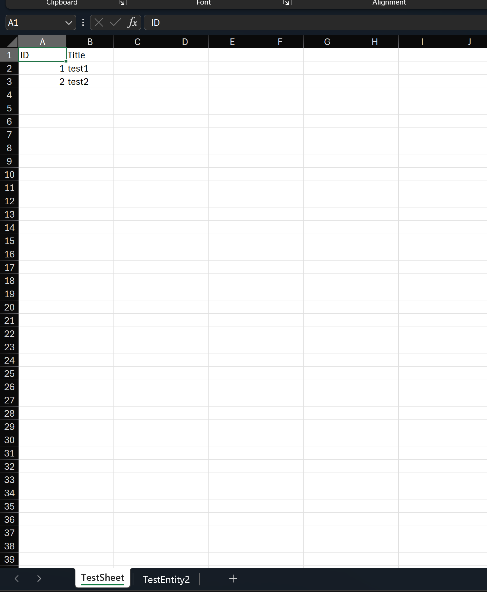
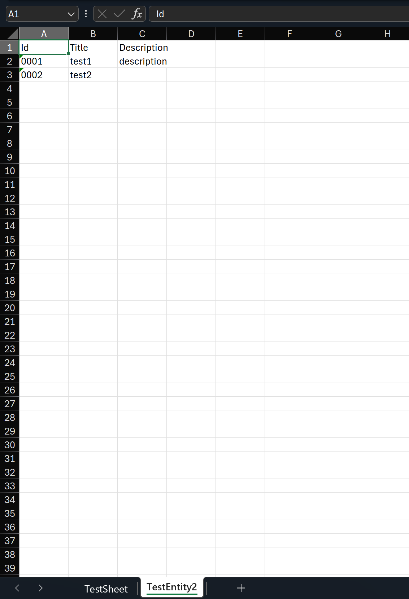

# 多 sheet 导出

## Intro

有时我们可能会希望在一个 excel 里导出多个 sheet 导出多个集合的数据，可以参考下面的示例代码：

## Sample

```c#
var collection1 = new[]
{
    new TestEntity1() { Id = 1, Title = "test1" },
    new TestEntity1() { Id = 2, Title = "test2" }
};
var collection2 = new[]
{
    new TestEntity2() { Id = 1, Title = "test1", Description = "description"},
    new TestEntity2() { Id = 2, Title = "test2" }
};
// 准备一个 workbook
var workbook = ExcelHelper.PrepareWorkbook(ExcelFormat.Xlsx);
// 导入 collection1 到第一个 sheet
workbook.ImportData(collection1);
// 导入 collection2 到第二个 sheet
workbook.ImportData(collection2, 1);
// 导出 workbook 到本地文件
workbook.WriteToFile("multi-sheets.xlsx");
```

如果需要自定义一些配置还是和之前是一样的，可以使用 attribute 的方式也可以使用 fluent API 的方式

```c#
[Sheet(SheetName = "TestSheet", SheetIndex = 0)]
file sealed class TestEntity1
{
    [Column("ID", Index = 0)]
    public int Id { get; set; }
    public string Title { get; set; } = string.Empty;
}

file sealed class TestEntity2
{
    public int Id { get; set; }
    public string Title { get; set; } = string.Empty;
    public string Description { get; set; }
}
```

Fluent API 配置如下：

```c#
var settings = FluentSettings.For<TestEntity2>();
settings.HasSheetSetting(sheet => sheet.SheetName = "TestEntity2", 1);
settings.Property(x => x.Id)
    .HasColumnIndex(0)
    .HasColumnOutputFormatter(v => v.ToString("#0000"))
    ;
settings.Property(x => x.Title)
    .HasColumnIndex(1)
    ;
settings.Property(x => x.Description)
    .HasColumnIndex(2)
    ;
```

导出结果如下：





## References

- <https://github.com/WeihanLi/SamplesInPractice/blob/main/NPOISample/MultiSheetsSample.cs>
- <https://github.com/WeihanLi/WeihanLi.Npoi/issues/157>
